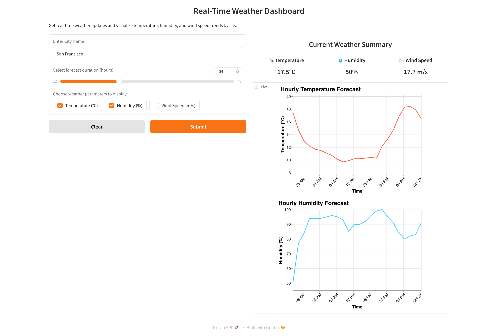

# Real-Time Weather Dashboard

This project is a real-time weather dashboard built using Gradio, Python, and Altair. It provides weather updates and visualizes temperature, humidity, and wind speed trends for a specified city over a given forecast duration.


## Features

- Get real-time weather updates by entering the city name.
- Displays current weather summary (temperature, humidity, wind speed).
- Visualizes weather parameters (temperature, humidity, wind speed) using interactive line charts.

## Prerequisites

To run this project, you will need the following Python packages:

- `gradio`
- `requests`
- `pandas`
- `altair`

You can install these dependencies using:

```bash
pip install gradio requests pandas altair
```

## Usage

1. Clone this repository and navigate to the project directory.
2. Run the Python script:

   ```bash
   python city_weather_dashboard.py
   ```

3. Open the local URL provided by Gradio to access the web interface.
4. Enter a city name (e.g., "San Francisco") and select the forecast duration and weather parameters to display.
5. The dashboard will display the current weather summary and visualize the weather trends over time.

## Code Overview

- **`get_coordinates(city_name)`**: Uses the Nominatim API to get the latitude and longitude of the given city.
- **`get_weather_data(lat, lon, hours)`**: Fetches weather data from the Open-Meteo API for the given coordinates.
- **`weather_dashboard(city_name, forecast_duration, parameter_options)`**: The main function that integrates Gradio UI, fetches weather data, and visualizes it using Altair.

## Example

When running the app, you will be able to:

- Enter a city name to get current weather details.
- View summary information such as temperature, humidity, and wind speed.
- Select which weather parameters to visualize, with charts updating accordingly.

## License

This project is open-source and available under the [MIT License](LICENSE).

## Acknowledgements

- [Gradio](https://gradio.app/): For building the UI.
- [Open-Meteo](https://open-meteo.com/): For weather data.
- [Altair](https://altair-viz.github.io/): For data visualization.

## Contact

For any inquiries or suggestions, please contact [your email address].
